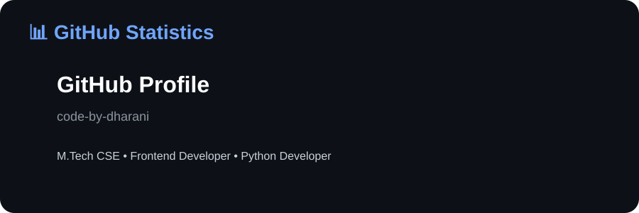
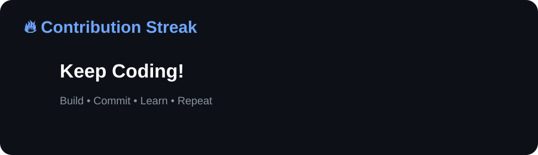
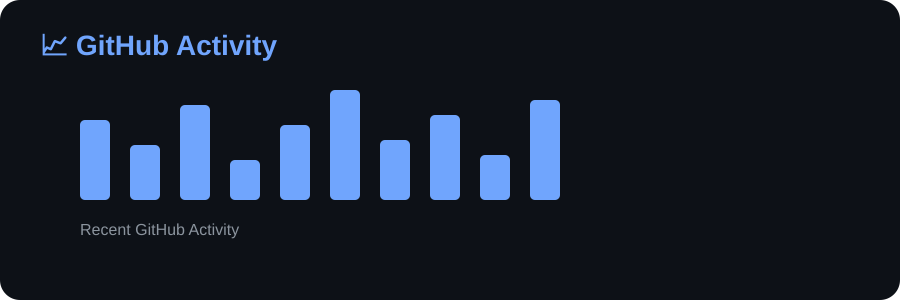
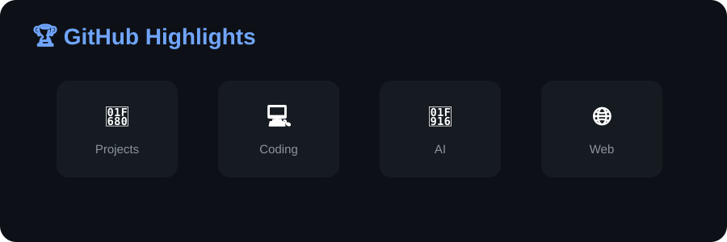

<!-- ===================================================== -->

<!-- HERO SECTION -->

<!-- ===================================================== -->

<div align="center">

# 👋 Hi, I'm **Dharanisri D**

### 💻 M.Tech CSE Student • Frontend Developer • Python Developer • AI Enthusiast

<p>
  
</p>


</div>

---

## 🧑‍💻 About Me


```python
class Dharanisri:
    def __init__(self):
        self.name = "Dharanisri D"
        self.location = "Tamil Nadu, India"
        self.degree = "M.Tech Computer Science & Engineering"
        self.college = "Sri Ramakrishna Engineering College"
        self.gpa = 8.65

        self.stack = [
            "HTML",
            "CSS",
            "JavaScript",
            "Python",
            "C"
        ]

        self.currently_learning = [
            "React & Next.js",
            "AI & Machine Learning",
            "Cloud Technologies"
        ]

        self.languages = {
            "Tamil": "Native",
            "English": "B2 - Upper Intermediate",
            "German": "A1 - Beginner"
        }

    def motto(self):
        return (
            "Build practical projects, explore new technologies, "
            "and keep learning every day."
        )

me = Dharanisri()
print(me.motto())
```

<br clear="right"/>

---

## 🛠️ Tech Stack & Tools

### Languages


### Frameworks & Technologies


### Tools & Platforms


---

# 📊 GitHub Statistics

<div align="center">



</div>

---

# 🔥 Contribution Streak

<div align="center">



</div>

---

# 📈 GitHub Activity

<div align="center">



</div>

---

# 🏆 GitHub Highlights

<div align="center">



</div>

---

## 💼 Work Experience

> Currently seeking opportunities as a Web Developer / Frontend Developer.

---

## 🚀 Featured Projects

<div align="center">

|                 Project                | Description                                                            |
| :------------------------------------: | :--------------------------------------------------------------------- |
|            ✋ **Air Sketch**            | AI-powered hand gesture drawing application using MediaPipe and OpenCV |
| 🚨 **Industry Emergency Alarm System** | Flask + MySQL based industrial safety management system                |
|          ✨ **Write It See It**         | Interactive web application with a modern user interface               |
|      🐍 **Expressions in Python**      | Collection of Python programming concepts and examples                 |

</div>

---

## 📌 Pinned Repositories

<div align="center">

🔗 [**Air-Sketch**](https://github.com/code-by-dharani/Air-Sketch)

🔗 [**IndustryEmergencyAlarmSystem**](https://github.com/code-by-dharani/IndustryEmergencyAlarmSystem)

🔗 [**Write-It-See-It**](https://github.com/code-by-dharani/Write-It-See-It)

🔗 [**Expressions-in-Python**](https://github.com/code-by-dharani/Expressions-in-Python)

🔗 [**Lightning-Hand**](https://github.com/code-by-dharani/Lightning-Hand)

</div>

---

## 🏅 Achievements

<div align="center">

| 🎖️ | Achievement                      | Details                              |
| :-: | :------------------------------- | :----------------------------------- |
|  🥇 | **Smart India Hackathon (SIH)**  | National-level hackathon participant |
|  💡 | **Youngs Mind Innovation (YMI)** | Innovation competition participant   |
|  🎓 | **Academic Excellence**          | 8.65 GPA                             |
|  🌿 | **NSS Club Member**              | Community service member             |
|  📜 | **C Programming Basics**         | Certified by Simplilearn             |

</div>

---

## 🎓 Education

<div align="center">

| Degree                                    | Institution                                     | Expected |     Score    |
| :---------------------------------------- | :---------------------------------------------- | :------: | :----------: |
| **M.Tech Computer Science & Engineering** | Sri Ramakrishna Engineering College, Coimbatore |  08/2030 | **8.65 GPA** |

</div>

---

## 🚀 Current Focus

```text
📚 Learning
├── React.js
├── Python Advanced
├── Data Structures & Algorithms
├── AI & Machine Learning
└── Cloud Computing Basics

🎯 Building
├── Portfolio Projects
├── AI-based Applications
└── Open Source Contributions
```

---

## 🎯 2026 Goals

* [ ] Build 10+ Full Stack Projects
* [ ] Learn React & Next.js
* [ ] Contribute to Open Source
* [ ] Complete AI Projects
* [ ] Land a Software Internship

---

## 🌐 Languages

<div align="center">

|     Language     |          Level          |
| :--------------: | :---------------------: |
|  🇮🇳 **Tamil**  |          Native         |
| 🇬🇧 **English** | B2 – Upper Intermediate |
|  🇩🇪 **German** |      A1 – Beginner      |

</div>

---

## 📬 Connect With Me

<div align="center">

<a href="mailto:dharu9599@gmail.com">

</a>

<a href="https://github.com/code-by-dharani">

</a>

</div>

---

<div align="center">

### ✨ *Keep Learning • Keep Building • Keep Growing* ✨

**Thanks for visiting my profile!**

</div>
